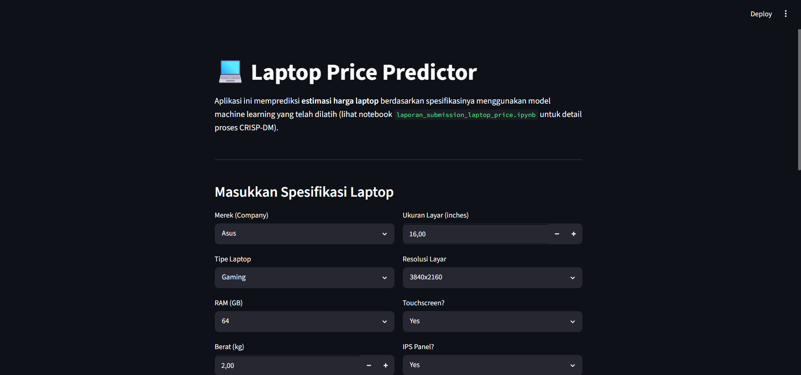
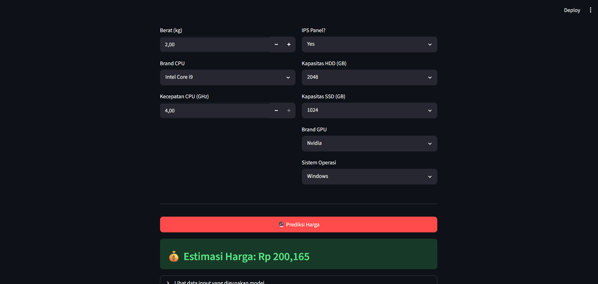

# Laporan Proyek Machine Learning - Prediksi Harga Laptop

## Domain Proyek

Pasar laptop saat ini memiliki variasi produk yang sangat luas, mulai dari segmen
entry-level hingga laptop gaming dan workstation kelas atas. Harga sebuah laptop
ditentukan oleh kombinasi banyak spesifikasi teknis seperti merek, jenis prosesor,
kapasitas RAM, jenis penyimpanan (SSD/HDD), kartu grafis (GPU), ukuran dan resolusi
layar, hingga sistem operasi yang digunakan.

Bagi konsumen, memahami hubungan antara spesifikasi dan harga dapat membantu menilai
apakah suatu laptop dijual dengan harga yang wajar. Bagi pelaku bisnis (retailer atau
e-commerce), kemampuan memprediksi harga berdasarkan spesifikasi dapat digunakan untuk
menentukan strategi penetapan harga (pricing strategy) yang kompetitif maupun untuk
mendeteksi harga tidak sesuai pada katalog produk.

Oleh karena itu, proyek ini bertujuan membangun model **machine learning regresi**
yang dapat memprediksi harga laptop berdasarkan spesifikasinya, dengan menerapkan
metodologi **CRISP-DM (Cross-Industry Standard Process for Data Mining)**.

**Referensi terkait:**
- Bhagat, R., & Bhanawat, V. (2021). *Laptop Price Prediction System Using Machine Learning*. International Journal of Computer Sciences and Engineering.

## Business Understanding

### Pernyataan Masalah

Berdasarkan latar belakang di atas, permasalahan yang akan diselesaikan dalam proyek
ini adalah:

- Bagaimana karakteristik dan distribusi data spesifikasi serta harga laptop pada
  dataset yang digunakan?
- Fitur atau spesifikasi apa yang memiliki pengaruh paling besar terhadap harga laptop?
- Bagaimana membangun model machine learning yang dapat memprediksi harga laptop
  berdasarkan spesifikasinya dengan tingkat kesalahan (error) yang rendah?

### Tujuan

Tujuan dari proyek ini adalah:

- Melakukan **Exploratory Data Analysis (EDA)** untuk memahami pola dan distribusi
  data spesifikasi serta harga laptop.
- Mengidentifikasi fitur-fitur yang paling berpengaruh terhadap harga laptop melalui
  proses *feature engineering* dan analisis *feature importance*.
- Membangun dan membandingkan beberapa model regresi untuk mendapatkan model dengan
  performa terbaik (error terkecil dan R² tertinggi), kemudian melakukan deployment
  model tersebut.

### Pernyataan Solusi

Untuk mencapai tujuan di atas, dilakukan pendekatan berikut:

1. **Membangun beberapa model baseline** menggunakan algoritma yang telah dipelajari
, yaitu **Linear Regression** dan **Random Forest Regressor**, lalu
   mengevaluasi performa masing-masing menggunakan metrik MAE, RMSE, dan R².
2. **Eksplorasi mandiri:** mengimplementasikan algoritma **XGBoost
   Regressor (Extreme Gradient Boosting)** yang belum diajarkan di kelas, sebagai
   pembanding terhadap model baseline. Algoritma ini dipilih karena dikenal memiliki
   performa tinggi pada data tabular dengan kombinasi fitur numerik dan kategorikal.
3. Model dengan performa terbaik (error terendah dan R² tertinggi pada data uji)
   dipilih sebagai **model final**, kemudian disimpan dan di-deploy menggunakan
   **Streamlit** agar dapat digunakan secara interaktif oleh pengguna.

## Pemahaman Data

Dataset yang digunakan berisi **1275 baris data** laptop dengan **11 kolom** (10
fitur dan 1 variabel target). Dataset disertakan pada folder `data/laptop_data.csv`
dalam repositori ini. Sumber referensi dataset serupa dapat ditemukan pada:
[Laptop Price Prediction Dataset - Kaggle](https://www.kaggle.com/datasets/arnabchaki/laptop-price-prediction)

### Variabel-variabel pada dataset:

| Variabel | Deskripsi |
|---|---|
| `Company` | Merek/produsen laptop (Dell, HP, Lenovo, Asus, Acer, dll). |
| `TypeName` | Kategori/tipe laptop (Notebook, Gaming, Ultrabook, 2 in 1 Convertible, Workstation, Netbook). |
| `Inches` | Ukuran layar dalam satuan inci. |
| `ScreenResolution` | Informasi resolusi layar, termasuk keterangan Touchscreen dan IPS Panel. |
| `Cpu` | Tipe dan kecepatan prosesor (CPU). |
| `Ram` | Kapasitas RAM (dalam GB). |
| `Memory` | Kapasitas dan jenis penyimpanan (SSD/HDD), dapat berupa kombinasi. |
| `Gpu` | Tipe kartu grafis (GPU). |
| `OpSys` | Sistem operasi yang digunakan. |
| `Weight` | Berat laptop (dalam kg). |
| `Price` | **(Target)** Harga laptop. |

### Exploratory Data Analysis (EDA)

Beberapa tahapan EDA yang dilakukan pada notebook:

- **Pengecekan struktur data**, tipe data, missing value, dan data duplikat — hasil
  menunjukkan dataset bersih tanpa missing value maupun duplikat.
- **Distribusi harga (`Price`)** divisualisasikan menggunakan histogram, menunjukkan
  distribusi yang condong ke kanan (right-skewed), di mana sebagian besar laptop
  berada pada rentang harga menengah dengan beberapa laptop bernilai sangat tinggi
  (laptop gaming/workstation kelas atas).
- **Rata-rata harga per merek (`Company`)** menunjukkan merek premium seperti Apple
  dan Razer memiliki rata-rata harga yang jauh lebih tinggi dibandingkan merek lain.
- **Rata-rata harga per tipe (`TypeName`)** menunjukkan laptop tipe Workstation dan
  Gaming memiliki rata-rata harga tertinggi, sedangkan Netbook memiliki rata-rata
  harga terendah.
- **Hubungan RAM dan harga** divisualisasikan menggunakan boxplot, menunjukkan tren
  kenaikan harga yang konsisten seiring bertambahnya kapasitas RAM.

## Data Preparation

Tahapan *data preparation* yang dilakukan secara berurutan adalah:

1. **Pembersihan kolom `Ram` dan `Weight`** — menghapus satuan teks ("GB", "kg") dan
   mengonversi ke tipe data numerik agar dapat diproses oleh model.
2. **Ekstraksi fitur dari `ScreenResolution`**:
   - `Touchscreen` (0/1) — menandai apakah layar memiliki fitur sentuh.
   - `IPS` (0/1) — menandai apakah layar menggunakan panel IPS.
   - `PPI` (Pixels Per Inch) — dihitung dari resolusi (lebar, tinggi) dan ukuran
     layar, sebagai representasi ketajaman/kerapatan piksel layar.
3. **Ekstraksi fitur dari `Cpu`**:
   - `Cpu_brand` — kategori prosesor (misal "Intel Core i5", "AMD Processor").
   - `Cpu_speed` — kecepatan clock prosesor dalam GHz (numerik).
4. **Ekstraksi fitur dari `Memory`**:
   - `SSD` dan `HDD` — kapasitas penyimpanan masing-masing tipe dalam GB, dipisah
     dari kolom `Memory` yang awalnya berupa teks gabungan (misal "256GB SSD + 1TB HDD").
5. **Ekstraksi fitur dari `Gpu` dan `OpSys`**:
   - `Gpu_brand` — diambil dari kata pertama pada kolom `Gpu` (Intel, Nvidia, AMD).
   - `os` — disederhanakan menjadi kategori "Windows", "Mac", "Other", atau "No OS".
6. **Transformasi target (`Price`)** — menerapkan **log-transform** (`np.log`) pada
   variabel target untuk mengurangi skewness distribusi harga dan menstabilkan
   varians, sehingga model regresi dapat belajar lebih baik. Hasil prediksi
   dikembalikan ke skala asli menggunakan `np.exp()` sebelum dievaluasi.
7. **Train-test split** — membagi data menjadi 80% data latih dan 20% data uji
   menggunakan `train_test_split` dengan `random_state=42`.
8. **Encoding fitur kategorikal** — menerapkan **One-Hot Encoding** pada fitur
   kategorikal (`Company`, `TypeName`, `Cpu_brand`, `Gpu_brand`, `os`) menggunakan
   `ColumnTransformer`, sementara fitur numerik dibiarkan tanpa transformasi
   tambahan (`passthrough`). Seluruh proses ini dibungkus dalam satu `Pipeline`
   bersama model agar konsisten diterapkan pada data latih maupun data baru.

**Alasan dilakukannya tahapan-tahapan tersebut:** algoritma machine learning
membutuhkan input numerik, sehingga seluruh kolom bertipe teks/campuran harus diubah
menjadi representasi numerik atau kategorikal yang valid. Ekstraksi fitur (seperti
PPI, Cpu_speed, SSD/HDD) juga dilakukan agar informasi penting yang awalnya
"tersembunyi" di dalam string dapat dimanfaatkan oleh model untuk meningkatkan akurasi
prediksi.

## Modeling

Pada tahap ini, tiga model regresi dilatih menggunakan data hasil *Data Preparation*:

### 1. Linear Regression (Baseline)

Linear Regression memodelkan hubungan linear antara fitur dan target.

- **Kelebihan:** sederhana, cepat dilatih, mudah diinterpretasikan (koefisien
  menunjukkan kontribusi setiap fitur).
- **Kekurangan:** tidak dapat menangkap hubungan non-linear antar fitur, sensitif
  terhadap outlier dan multikolinearitas.
- **Parameter:** menggunakan parameter default dari `sklearn.linear_model.LinearRegression`.

### 2. Random Forest Regressor

Random Forest adalah model *ensemble* berbasis *bagging* yang membangun banyak
decision tree dan menggabungkan hasil prediksinya (rata-rata).

- **Kelebihan:** mampu menangkap hubungan non-linear, relatif tahan terhadap
  overfitting dibandingkan single decision tree, dapat menghitung *feature importance*.
- **Kekurangan:** ukuran model lebih besar, waktu prediksi lebih lambat dibanding
  model linear, serta kurang dapat diinterpretasikan secara langsung.
- **Parameter yang digunakan:** `n_estimators=200`, `max_depth=15`, `random_state=42`.

### 3. XGBoost Regressor (Eksplorasi Mandiri / Poin Plus)

XGBoost (*Extreme Gradient Boosting*) adalah algoritma *ensemble* berbasis
*boosting* yang membangun model secara bertahap, di mana setiap tree baru berusaha
memperbaiki kesalahan (residual) dari tree sebelumnya. **Algoritma ini belum diajarkan
di kelas** dan diimplementasikan sebagai bagian dari eksplorasi mandiri.

- **Kelebihan:** umumnya memiliki performa prediksi yang sangat baik pada data
  tabular, mendukung regularisasi untuk mengurangi overfitting, serta efisien
  secara komputasi.
- **Kekurangan:** memiliki lebih banyak hyperparameter yang perlu di-*tuning*,
  lebih kompleks untuk diinterpretasikan, dan berisiko overfitting jika parameter
  tidak diatur dengan tepat.
- **Parameter yang digunakan:** `n_estimators=300`, `learning_rate=0.05`,
  `max_depth=6`, `subsample=0.8`, `colsample_bytree=0.8`, `random_state=42`.

### Pemilihan Model Terbaik

Ketiga model dievaluasi menggunakan data uji (20% dari total data) dengan metrik MAE,
RMSE, dan R² (lihat bagian **Evaluation**). Model dengan **R² tertinggi dan error
(MAE & RMSE) terendah** dipilih sebagai model terbaik dan disimpan ke dalam file
`model/best_model.pkl` untuk digunakan pada tahap deployment.

## Evaluation

### Metrik Evaluasi

Karena proyek ini merupakan permasalahan **regresi**, metrik evaluasi yang digunakan
adalah:

1. **Mean Absolute Error (MAE)**

   $$MAE = \\frac{1}{n}\\sum_{i=1}^{n}|y_i - \\hat{y}_i|$$

   Mengukur rata-rata besarnya kesalahan prediksi tanpa memperhatikan arah (positif
   atau negatif). Semakin kecil nilainya, semakin akurat model.

2. **Root Mean Squared Error (RMSE)**

   $$RMSE = \\sqrt{\\frac{1}{n}\\sum_{i=1}^{n}(y_i - \\hat{y}_i)^2}$$

   Mengukur akar dari rata-rata kuadrat kesalahan, sehingga memberikan penalti lebih
   besar terhadap kesalahan prediksi yang besar dibandingkan MAE.

3. **R² Score (Coefficient of Determination)**

   $$R^2 = 1 - \\frac{\\sum_{i=1}^{n}(y_i - \\hat{y}_i)^2}{\\sum_{i=1}^{n}(y_i - \\bar{y})^2}$$

   Mengukur seberapa besar proporsi variansi target yang dapat dijelaskan oleh model.
   Nilai R² berkisar antara 0 hingga 1, di mana semakin mendekati 1 menunjukkan model
   semakin baik dalam menjelaskan variasi data.

Ketiga metrik di atas dihitung pada skala harga asli (bukan skala log), dengan
mengembalikan hasil prediksi log menggunakan `np.exp()` sebelum dibandingkan dengan
nilai aktual.

### Hasil Evaluasi

| Model | MAE | RMSE | R² |
|---|---|---|---|
| Linear Regression | 7.353,55 | 10.552,35 | 0,9068 |
| Random Forest | 8.539,65 | 11.739,16 | 0,8847 |
| **XGBoost (Eksplorasi Mandiri)** | **6.867,34** | **9.589,46** | **0,9231** |

> Catatan: nilai di atas merupakan hasil pada dataset yang disertakan dalam
> repositori ini (`data/laptop_data.csv`) dengan `random_state=42`. Nilai dapat
> sedikit berbeda jika dataset diganti dengan versi lain.

### Kesimpulan Evaluasi

Berdasarkan tabel di atas, **XGBoost Regressor** memberikan performa terbaik dengan
nilai **MAE dan RMSE terendah** serta **R² tertinggi (0,9231)**, yang berarti model
ini dapat menjelaskan sekitar 92,31% variasi harga laptop berdasarkan fitur-fitur yang
digunakan. Hasil ini menjawab seluruh *problem statements*:

- Model berhasil dibangun dan dapat memprediksi harga laptop dengan tingkat error
  yang relatif kecil dibandingkan rentang harga pada dataset (rata-rata harga ±87.000,
  dengan MAE ±6.867).
- Berdasarkan analisis *feature importance* pada model Random Forest, fitur **RAM,
  PPI (resolusi layar), kapasitas SSD, dan brand CPU/GPU** terbukti menjadi faktor
  yang paling berpengaruh terhadap harga laptop, sejalan dengan intuisi domain bahwa
  spesifikasi performa utama menentukan harga.
- Algoritma **XGBoost** sebagai eksplorasi mandiri berhasil mengungguli kedua model
  baseline (Linear Regression dan Random Forest), sehingga dipilih sebagai model
  final untuk tahap deployment.

## Deployment

Model terbaik (XGBoost, disimpan sebagai `model/best_model.pkl`) di-deploy dalam
bentuk aplikasi web interaktif menggunakan **Streamlit** (`app.py`). Aplikasi
memungkinkan pengguna memasukkan spesifikasi laptop (merek, tipe, RAM, CPU, GPU,
penyimpanan, dll) dan mendapatkan estimasi harga secara langsung.

### Cara Menjalankan Secara Lokal

```bash
# 1. Clone repositori
git clone <url-repositori-ini>
cd <nama-folder-repositori>

# 2. Install dependencies
pip install -r requirements.txt

# 3. Jalankan aplikasi
streamlit run app.py
```

### Struktur Repositori

```
├── data/
│   └── laptop_data.csv                          # Dataset
├── model/
│   └── best_model.pkl                           # Model terbaik (hasil training)
├── laporan_submission_laptop_price.ipynb        # Notebook (CRISP-DM lengkap)
├── app.py                                       # Aplikasi deployment (Streamlit)
├── requirements.txt                             # Daftar dependencies
└── README.md                                    # Laporan proyek (dokumen ini)
```

---


**Disusun oleh:**
- Muhammad Fakhriy Daffa Delyan (2330511019)
- Muhammad Fakhri Fauzi (2330511019)
